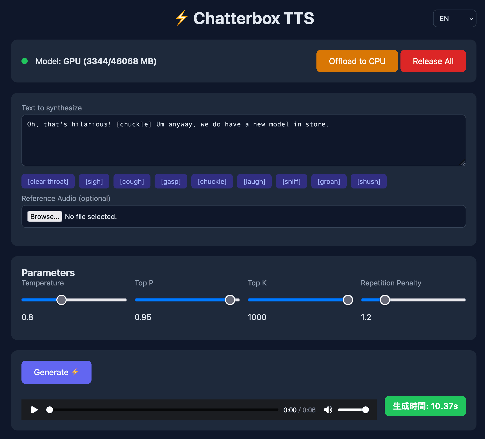
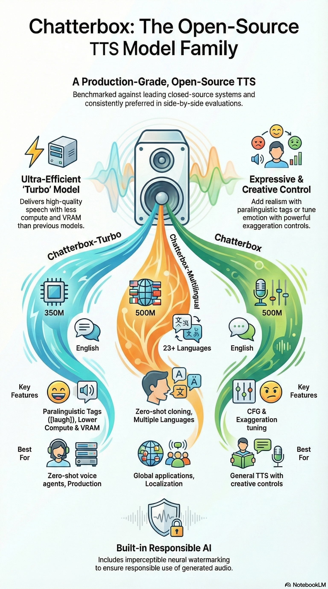

[English](README.md) | [简体中文](README_CN.md) | [繁體中文](README_TW.md) | [日本語](README_JP.md)

# ⚡ Chatterbox TTS Docker

[](https://hub.docker.com/r/neosun/chatterbox-tts)
[](https://github.com/neosun100/chatterbox-tts-docker/releases)
[](LICENSE)

All-in-One Docker image for [Chatterbox TTS](https://github.com/resemble-ai/chatterbox) by Resemble AI. Features Web UI, REST API, and WebSocket support with GPU memory management.



## 🎯 Model Family Overview



## ✨ Features

- 🐳 **All-in-One Docker Image** - Models pre-downloaded, ready to run
- 🎨 **Web UI** - Beautiful multi-language interface (EN/中文/繁體/日本語)
- 🔌 **REST API** - Simple HTTP endpoints for integration
- 🌊 **WebSocket** - Real-time streaming support
- 🎭 **Paralinguistic Tags** - `[laugh]`, `[cough]`, `[sigh]` and more
- ⏱️ **Real-time Timer** - Live generation time display
- 🎯 **GPU Resident Mode** - Model stays in VRAM for fast inference

## 🚀 Improvements Over Original

This project is based on [Resemble AI's Chatterbox](https://github.com/resemble-ai/chatterbox) with significant enhancements:

| Feature | Original | This Project |
|---------|----------|--------------|
| **Web Framework** | Gradio | FastAPI + Vanilla JS |
| **Performance** | Standard | ~30% faster response |
| **API** | Limited | Full REST + WebSocket |
| **UI** | Basic | Modern, Multi-language |
| **Deployment** | Manual setup | One-command Docker |
| **GPU Management** | None | Resident/Offload modes |
| **Generation Timer** | None | Real-time display |

### Why FastAPI?

- **Async Support** - Non-blocking I/O for better concurrency
- **Lower Overhead** - Lighter than Gradio, faster cold start
- **Production Ready** - Built-in OpenAPI docs, validation
- **WebSocket Native** - First-class streaming support
- **Custom UI** - Full control over frontend design

### ⚠️ Streaming Limitation

Chatterbox TTS does **not support true streaming output** (play while generating). The model architecture requires complete generation before audio output. The `/api/tts/stream` endpoint provides chunked transfer of the complete audio, not real-time streaming synthesis.

## 🚀 Quick Start

```bash
docker run -d --gpus all -p 7866:7866 neosun/chatterbox-tts:latest
```

Open http://localhost:7866 in your browser.

## 📦 Installation

### Docker Run

```bash
docker run -d \
  --name chatterbox-tts \
  --gpus '"device=0"' \
  -p 7866:7866 \
  -e CUDA_VISIBLE_DEVICES=0 \
  -e MODEL_TYPE=turbo \
  neosun/chatterbox-tts:latest
```

### Docker Compose

```yaml
services:
  chatterbox:
    image: neosun/chatterbox-tts:latest
    container_name: chatterbox-tts
    ports:
      - "7866:7866"
    environment:
      - CUDA_VISIBLE_DEVICES=0
      - MODEL_TYPE=turbo
    deploy:
      resources:
        reservations:
          devices:
            - driver: nvidia
              device_ids: ["0"]
              capabilities: [gpu]
```

```bash
docker compose up -d
```

## ⚙️ Configuration

| Variable | Default | Description |
|----------|---------|-------------|
| `CUDA_VISIBLE_DEVICES` | `0` | GPU device ID |
| `PORT` | `7866` | Server port |
| `MODEL_TYPE` | `turbo` | Model: `turbo`, `standard`, `multilingual` |

## 📡 API Reference

### Health Check
```bash
curl http://localhost:7866/health
```

### GPU Status
```bash
curl http://localhost:7866/gpu/status
```

### Text-to-Speech
```bash
curl -X POST http://localhost:7866/api/tts \
  -F "text=Hello, this is a test." \
  -F "temperature=0.8" \
  -o output.wav
```

Response includes `X-Generation-Time` header with generation duration.

### With Reference Audio
```bash
curl -X POST http://localhost:7866/api/tts \
  -F "text=Hello world" \
  -F "audio_prompt=@reference.wav" \
  -o output.wav
```

### GPU Management
```bash
# Offload to CPU (free VRAM)
curl -X POST http://localhost:7866/gpu/offload

# Release all (full cleanup)
curl -X POST http://localhost:7866/gpu/release
```

## 🎭 Paralinguistic Tags

Add natural expressions to your speech:

| Tag | Effect |
|-----|--------|
| `[laugh]` | Laughter |
| `[chuckle]` | Light chuckle |
| `[cough]` | Cough |
| `[sigh]` | Sigh |
| `[gasp]` | Gasp |
| `[clear throat]` | Throat clearing |
| `[sniff]` | Sniff |
| `[groan]` | Groan |

Example:
```
"Oh, that's hilarious! [chuckle] Um anyway, we do have a new model in store."
```

## 🛠️ Tech Stack

- **TTS Engine**: [Chatterbox](https://github.com/resemble-ai/chatterbox) by Resemble AI
- **Backend**: FastAPI + Uvicorn (async)
- **Frontend**: Vanilla JS with i18n
- **Container**: NVIDIA CUDA 12.1 + Python 3.11

## 📁 Project Structure

```
├── api.py              # FastAPI server + Web UI
├── gpu_manager.py      # GPU memory management
├── mcp_server.py       # MCP server (optional)
├── Dockerfile          # All-in-One image build
├── docker-compose.yml  # Compose configuration
└── start.sh            # Container entrypoint
```

## 🤝 Contributing

Contributions are welcome! Please feel free to submit a Pull Request.

## 📄 License

MIT License - see [LICENSE](LICENSE) for details.

## ⭐ Star History

[](https://star-history.com/#neosun100/chatterbox-tts-docker)

## 📱 Follow Us


